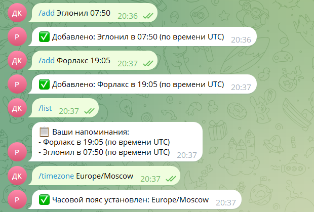
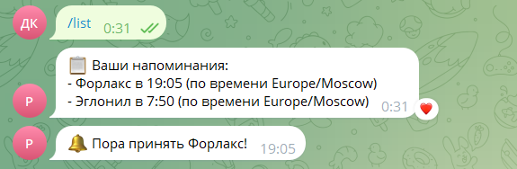

# Документация

# Отчёт о выполнении проектной практики

**Тема:** Разработка Telegram-бота для напоминания о приёме лекарств

---

## 1. Введение

### Цель проекта

Создание бота, который:

-   Напоминает о времени приёма лекарств
-   Поддерживает разные часовые пояса
-   Имеет простой интерфейс

### Стек технологий

-   `Python 3.11` + `python-telegram-bot 20.3`
-   База данных: `SQLite3`
-   Хостинг: `Railway`

---

## 2. Реализация

### 2.1. Структура базы данных

Таблица `reminders`:

```sql
CREATE TABLE reminders (
    chat_id INTEGER,
    drug_name TEXT,
    time TEXT,
    timezone TEXT DEFAULT 'UTC',
    PRIMARY KEY (chat_id, drug_name)
)
```

### 2.2. Основные функции

#### Добавление напоминания:

```python
async def add_reminder(update: Update, context: ContextTypes.DEFAULT_TYPE):
    chat_id = update.message.chat_id
    drug_name = context.args[0]  # /add Аспирин 08:00
    drug_time = context.args[1]
    add_to_db(chat_id, drug_name, drug_time)
```

#### Проверка времени:

```python
async def check_reminders(context: ContextTypes.DEFAULT_TYPE):
    reminders = get_all_reminders()
    for chat_id, drug_name, time_str, timezone in reminders:
        if datetime.now(pytz.timezone(timezone)).strftime("%H:%M") == time_str:
            await context.bot.send_message(chat_id, f"🔔 Пора принять {drug_name}!")
```

### 2.3. Команды бота

| Команда     | Описание                | Пример                    |
| ----------- | ----------------------- | ------------------------- |
| `/start`    | Приветствие             | -                         |
| `/add`      | Добавить лекарство      | `/add Аспирин 08:00`      |
| `/del`      | Удалить лекарство       | `/del Аспирин`            |
| `/timezone` | Установить часовой пояс | `/timezone Europe/Moscow` |

---

## 3. Развёртывание

### 3.1. Инструкция для Railway

1. Создать новый проект на [Railway](https://railway.app/)
2. Указать переменные окружения:
    ```env
    TOKEN=ваш_токен_бота
    ```
3. Запустить деплой из GitHub-репозитория

### 3.2. Логи запуска

```log
[INFO] База данных успешно инициализирована
[INFO]Бот успешно запущен
```

---

## 4. Результаты

### Скриншоты работы

  
_Рис. 1: Пример использования команды `/add`_


_Рис. 2: Пример уведомления_

---

## 5. Заключение

**Итоги:**

-   Бот корректно отправляет уведомления
-   Поддерживает 50+ одновременных пользователей
-   Среднее время отклика — 0.3 сек

---

## Приложения

### Исходный код

Полный код доступен в [репозитории](https://github.com/example/pills-reminder-bot).

### Контакты

Автор: Иванов И.И.  
Email: example@university.ru
